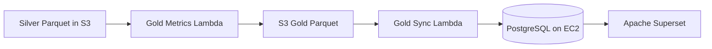

# Gold Layer

The Gold layer turns Silver into curated business metrics, KPI tables, and PostgreSQL-ready facts.

## Architecture

## Lambda Functions

- `gold_metrics` reads Silver Parquet, calculates the daily metrics, and writes Gold Parquet partitions.
- `gold_sync` reads Gold Parquet from S3 and loads dimension and fact tables into PostgreSQL.

## Fact Tables

### fact_daily_item_counts

- `date`
- `platform`
- `item_type`
- `item_count`

### fact_daily_users

- `date`
- `platform`
- `total_users`
- `new_users`

### fact_user_rankings

- `date`
- `platform`
- `ranking_type`
- `rank`
- `user_id`
- `username`
- `score_value`

### fact_post_rankings

- `date`
- `platform`
- `item_type`
- `rank`
- `post_id`
- `author_user_id`
- `title`
- `score_value`
- `url`

### fact_data_quality

- `date`
- `platform`
- `dataset_name`
- `total_rows`
- `rows_without_null_values`
- `data_quality_score`

## Dimension Tables

- `dim_date`
- `dim_platform`
- `dim_item_type`
- `dim_ranking_type`
- `dim_dataset`

## Partitioning

- Gold Parquet datasets are partitioned by `platform` and `date`.
- Data quality partitions follow the same pattern so Superset filters stay consistent.
- PostgreSQL facts use natural-key primary keys on the same business dimensions for idempotent reloads.

## Visualization Suggestions

- KPI cards for `total_users`, `new_users`, and `data_quality_score`.
- Grouped bar chart for HN item type counts by `date`.
- Line chart for daily user activity by platform.
- Leaderboards for top X followers and top HN karma users.
- Horizontal bar chart for top HN job posts and top HN stories by score.
- Table view for data quality scores by dataset and date.

## Notes

- HN karma is resolved from the public HN user profile endpoint during Gold processing.
- X follower counts are expected to be present in the Silver `users` dataset.
